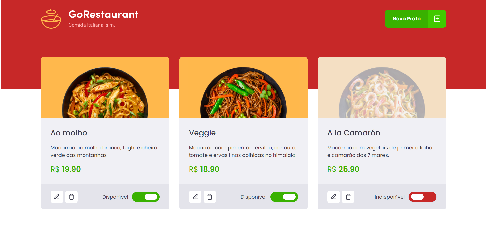

O segundo desafio complementar da trilha de React do Ignite baseou-se numa refatoração de código. Foi dada uma aplicação (GoRestaurant), que é basicamente uma página para gerenciar os pratos disponíveis no cardápio de um restaurante italiano.

 Esta aplicação React foi totalmente desenvolvida utilizando JavaScript e todos os componentes foram implementados como *class components*. O objetivo do desafio, portanto, foi justamente refatorar o projeto, convertendo código JavaScript em TypeScript e também substituindo os *class components* por *function(al) components* (FC).

Ao final do desafio, o projeto foi totalmente refatorado, ou seja, todos os componentes foram convertidos em *function(al) components* e o código foi totalmente reescrito utilizando TypeScript. Com isso, transformamos um projeto com um código relativamente legado em um código mais robusto e mais fácil de manter.